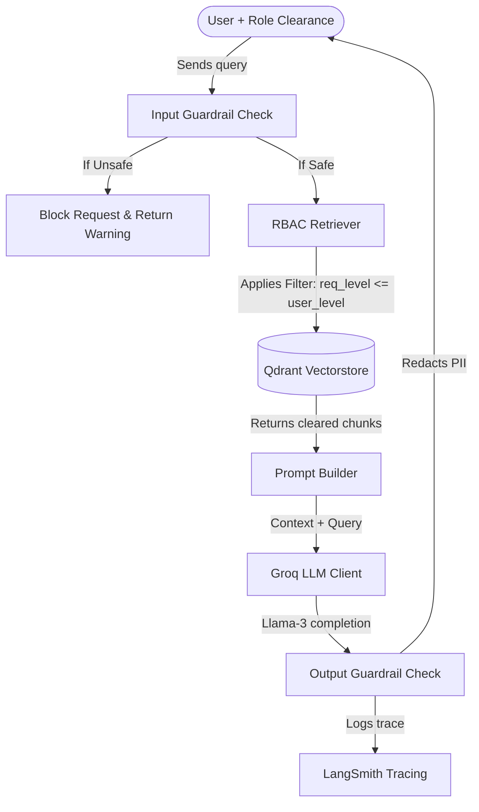

# 🛡️ SentinelRAG

SentinelRAG is a secure enterprise Retrieval-Augmented Generation (RAG) system designed to process private company documents with strict Role-Based Access Control (RBAC), input/output guardrails, quality tracking using Ragas, and execution tracing via LangSmith, running on Groq + Llama models.

---

## 🚀 Key Features

1. **Private Document Ingestion**: Splitting and indexing private company PDFs (`data/financial_report.pdf` and `data/IPO-IndustryReport.pdf`) in a local Qdrant vector database.
2. **Role-Based Access Control (RBAC)**: Fine-grained security mapping for company roles (`EMPLOYEE`, `EXECUTIVE`, `ADMIN`). The database retrieval is strictly filtered so that users can only view and generate answers from documents that match or are below their clearance level.
3. **AI Security Guardrails**:
   - **Input Guardrail**: Scans queries for toxic content and common prompt injection patterns.
   - **Output Guardrail**: Automatically detects and redacts Personally Identifiable Information (PII) like phone numbers, emails, and SSNs.
4. **LangSmith Monitoring**: End-to-end tracing of retrieval and generation queries.
5. **Ragas Evaluation**: Scripted evaluations of RAG quality, including faithfulness and answer relevance.
6. **Llama models on Groq**: Low-latency, high-performance completions powered by `llama-3.1-8b-instant`.
7. **Premium Dashboard**: A modern, interactive Streamlit frontend with a futuristic dark mode theme, glassmorphic source cards, and clearance badges.

---

## 🛠️ Architecture Flow



---

## ⚙️ Project Setup

### 1. Prerequisites
- Python 3.12+
- A Groq API Key
- (Optional) A LangSmith API Key

### 2. Environment Configuration
Create a `.env` file in the root directory (based on the provided template):
```env
GROQ_API_KEY=your_groq_api_key
LANGCHAIN_API_KEY=your_langsmith_key
LANGCHAIN_TRACING_V2=true
```

### 3. Installation
Activate your virtual environment and install the required dependencies:
```bash
# Windows
venv\Scripts\activate
pip install -r requirements.txt
```

### 4. Running Document Ingestion
To populate the vector database with private company documents, run:
```bash
python -m app.ingestion.ingestion
```

### 5. Running the Streamlit App
Launch the interactive dashboard:
```bash
streamlit run app/frontend/app.py
```

### 6. Running Evaluations
Run the Ragas quality evaluation:
```bash
python -m app.monitoring.evaluation
```

### 7. Running Unit Tests
Execute the test suite to verify the security protocols (RBAC and Guardrails):
```bash
python -m pytest tests/
```
